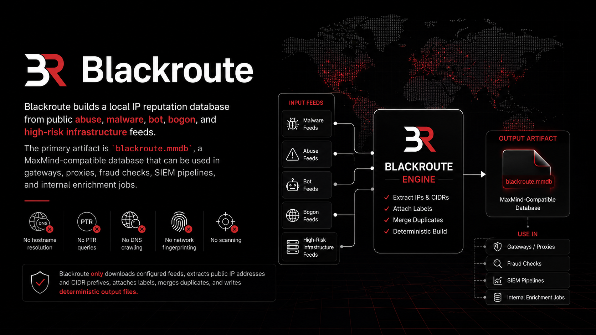

# Blackroute

<p align="center">
  
</p>

<p align="center">
  <a href="LICENSE">
    
  </a>


  <a href="https://github.com/blackroute/blackroute">
    
  </a>
  <a href="https://blackroute.io">
    
  </a>
  <a href="https://github.com/blackroute/blackroute">
    
  </a>
</p>

---

Blackroute builds deterministic IP reputation datasets from public abuse, malware, scanner, botnet, proxy, VPN, Tor, and high-risk infrastructure feeds. The primary artifact is `blackroute.mmdb`, a MaxMind-compatible database designed for gateways, SIEM pipelines, fraud systems, enrichment jobs, and network intelligence workflows.

The platform ingests public IP/CIDR feeds, normalizes metadata, merges overlapping ranges, applies label attribution, and produces reproducible output datasets optimized for operational use.

---

## Overview

Blackroute is an offline-first reputation aggregation pipeline focused on IP infrastructure intelligence.

The project is designed for environments where lightweight local lookups are preferred over external API dependencies:

* reverse proxies
* WAF pipelines
* abuse prevention
* fraud scoring
* enrichment services
* telemetry correlation
* crawler filtering
* VPN/Tor visibility
* SOC and SIEM pipelines

The generated database can be queried locally with standard MaxMind readers in Go, Python, Rust, Node.js, Java, NGINX, Envoy, HAProxy, and other compatible systems.

---

## Architecture

```text
                ┌────────────────────┐
                │ Public IP Feeds    │
                │ Abuse / Malware    │
                │ VPN / Tor / Bots   │
                └─────────┬──────────┘
                          │
                          ▼
               ┌─────────────────────┐
               │ Feed Collectors     │
               │ HTTP / CSV / TXT    │
               └─────────┬───────────┘
                         │
                         ▼
               ┌─────────────────────┐
               │ Normalization       │
               │ CIDR Expansion      │
               │ Deduplication       │
               └─────────┬───────────┘
                         │
                         ▼
               ┌─────────────────────┐
               │ Label Attribution   │
               │ Confidence Mapping  │
               │ Source Aggregation  │
               └─────────┬───────────┘
                         │
                         ▼
               ┌─────────────────────┐
               │ Dataset Builders    │
               │ MMDB / CSV / JSON   │
               └─────────┬───────────┘
                         │
                         ▼
               ┌─────────────────────┐
               │ Operational Outputs │
               │ Gateways / SIEM     │
               │ Fraud / Analytics   │
               └─────────────────────┘
```

---

## Features

| Capability              | Description                                   |
| ----------------------- | --------------------------------------------- |
| MaxMind-compatible MMDB | Local high-speed IP lookups                   |
| Deterministic builds    | Reproducible dataset generation               |
| Multi-feed aggregation  | Merge multiple public intelligence sources    |
| CIDR-aware processing   | Native prefix normalization and deduplication |
| Label attribution       | Attach source and reputation metadata         |
| Offline-first operation | No runtime API dependency                     |
| Multi-format exports    | MMDB, CSV, JSONL, flat lists                  |
| IPv4 + IPv6 support     | Unified processing pipeline                   |
| Incremental updates     | Scheduled refresh workflows                   |
| Feed isolation          | Per-source debugging and validation           |

---

## Project Scope

Blackroute focuses on:

* public IP reputation aggregation
* infrastructure classification
* high-risk network visibility
* operational enrichment datasets
* reproducible local lookup artifacts

The project does not perform active scanning, DNS crawling, traffic interception, or network fingerprinting.

---

## Quick Start

### Build Dataset

```bash
git clone https://github.com/blackroute/blackroute.git
cd blackroute

make feeds
make build
```

Generated artifacts:

```text
dist/
├── blackroute.mmdb
├── blackroute.csv
├── blackroute.jsonl
├── blackroute.txt
└── metadata.json
```

---

## Installation

### Go

```bash
go install github.com/blackroute/blackroute/cmd/blackroute@latest
```

### Docker

```bash
docker build -t blackroute .
docker run --rm -v $(pwd)/dist:/data blackroute
```

### Prebuilt Releases

```bash
curl -LO https://github.com/blackroute/blackroute/releases/latest/download/blackroute-linux-amd64
chmod +x blackroute-linux-amd64
```

---

## Usage

### Generate Full Dataset

```bash
blackroute build \
  --config ./config/config.yml \
  --output ./dist
```

### Update Feeds

```bash
blackroute feeds sync
```

### Validate Sources

```bash
blackroute feeds validate
```

### Inspect Dataset Statistics

```bash
blackroute stats ./dist/blackroute.mmdb
```

---

## MMDB Lookup Example

### Go

```go
db, err := maxminddb.Open("blackroute.mmdb")
if err != nil {
    panic(err)
}

var result struct {
    Labels     []string `maxminddb:"labels"`
    Confidence int      `maxminddb:"confidence"`
}

ip := net.ParseIP("185.220.101.1")

err = db.Lookup(ip, &result)
fmt.Println(result.Labels)
```

### Python

```python
import geoip2.database

reader = geoip2.database.Reader("blackroute.mmdb")

result = reader.get("185.220.101.1")

print(result)
```

---

## Output Artifacts

| Artifact           | Description                            |
| ------------------ | -------------------------------------- |
| `blackroute.mmdb`  | MaxMind-compatible reputation database |
| `blackroute.csv`   | Flat export for analytics pipelines    |
| `blackroute.jsonl` | Structured enrichment stream           |
| `blackroute.txt`   | Raw IP/CIDR export                     |
| `metadata.json`    | Build metadata and source inventory    |

---

## Dataset Schema

### MMDB Record

```json
{
  "ip": "185.220.101.1",
  "labels": [
    "tor_exit",
    "vpn",
    "scanner"
  ],
  "sources": [
    "tor",
    "abuse_feed"
  ],
  "confidence": 92,
  "first_seen": "2026-05-01T00:00:00Z",
  "last_seen": "2026-05-20T00:00:00Z"
}
```

---

## Feed Configuration

```yaml
feeds:
  - name: tor
    type: txt
    url: https://example.org/tor-exits.txt

  - name: scanners
    type: csv
    url: https://example.org/scanners.csv
```

---

## Operational Notes

### Update Frequency

Most deployments rebuild datasets every 1-6 hours depending on feed volatility.

### Storage

The MMDB artifact is memory-efficient and optimized for local embedded lookups.

### Deterministic Output

Input ordering, merge rules, and export generation are deterministic to support reproducible builds and stable diffs.

### Feed Hygiene

Malformed records, private ranges, invalid CIDRs, and reserved prefixes are filtered during normalization.

---

## Deployment

### CI Pipeline

```yaml
name: build

on:
  schedule:
    - cron: "0 */6 * * *"

jobs:
  build:
    runs-on: ubuntu-latest

    steps:
      - uses: actions/checkout@v4

      - name: Build dataset
        run: |
          make feeds
          make build
```

### Example Deployment Targets

* NGINX enrichment
* HAProxy ACL pipelines
* Envoy external auth
* ClickHouse enrichment
* Elasticsearch ingest pipelines
* Kafka stream enrichment
* Fraud/risk scoring services
* Internal SIEM correlation

---

## Use Cases

| Domain              | Example                                 |
| ------------------- | --------------------------------------- |
| Fraud Detection     | VPN/Tor scoring and infrastructure risk |
| SOC Operations      | Malicious infrastructure enrichment     |
| API Security        | Automated gateway filtering             |
| Bot Management      | Scanner and crawler visibility          |
| Threat Intelligence | Feed aggregation and correlation        |
| Analytics           | Historical infrastructure analysis      |

---

## Directory Structure

```text
.
├── cmd/
├── internal/
├── feeds/
├── config/
├── dist/
├── scripts/
├── site/
├── examples/
├── testdata/
└── docs/
```

---

## Limitations

Blackroute reflects upstream public feed quality and update cadence. Reputation data is probabilistic infrastructure intelligence, not a definitive indicator of malicious activity.

Operational filtering decisions should incorporate additional telemetry and local context.

---

## Roadmap

* ASN-level aggregation
* Historical delta snapshots
* Feed confidence weighting
* Native ClickHouse exports
* Prefix lineage tracking
* Signed dataset releases

---

## License

Licensed under the Apache License 2.0.

See [`LICENSE`](./LICENSE).

---

## Disclaimer

This repository aggregates publicly available infrastructure reputation data for defensive, analytical, and operational use. Users are responsible for validating suitability within their own environments.
